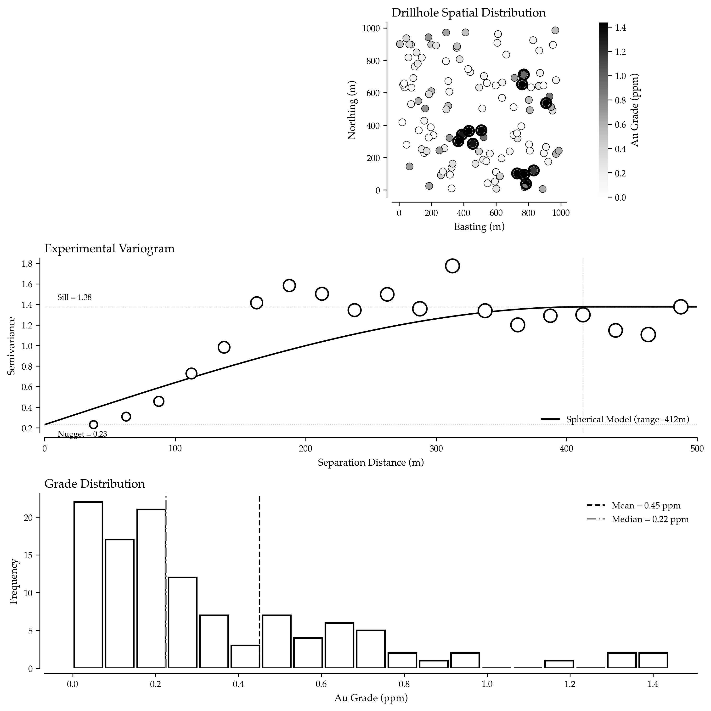
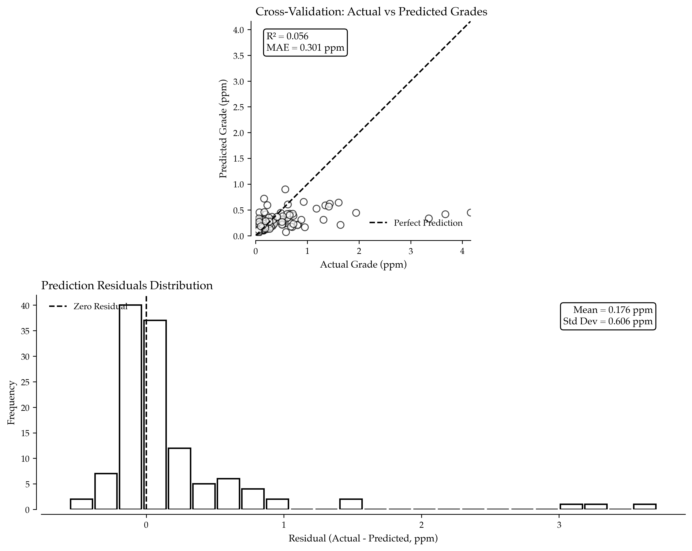

# Ore Grade Forecasting: Turning Sparse Drillholes into Profitable Mining Decisions

When Barrick Gold acquired the Pueblo Viejo mine in the Dominican Republic, their ore reserve estimates varied by nearly 30% depending on which interpolation method they used. The difference represented billions of dollars in valuation uncertainty. Professional mining companies that master spatial grade forecasting gain decisive advantages in mine planning, investment decisions, and production optimization—advantages that translate directly to shareholder returns.

Ore grade forecasting isn't just about filling gaps between drillholes—it's about quantifying uncertainty, understanding spatial correlation, and making optimal decisions under incomplete information. Modern machine learning techniques augment traditional geostatistics, delivering more accurate predictions and more realistic uncertainty estimates that enable better capital allocation.

## Why Grade Forecasting Determines Mine Value

Every mining operation is built on grade estimates derived from sparse sampling. A typical gold deposit might have drillholes spaced 50-100 meters apart, yet mining decisions operate at 5-10 meter block scales. This means 95-99% of your resource tonnage is based on interpolation rather than direct measurement.

Professional mining companies use grade forecasting to estimate mineral resources and ore reserves for regulatory reporting and financing, optimize pit shell designs to maximize net present value, schedule mining sequences that meet mill feed grade targets and blending requirements, assess acquisition targets and bid competitively with quantified confidence levels, and manage production risk through realistic simulation of grade variability.

The difference between a forecast error of 15% versus 8% can mean the difference between a profitable mine and a stranded asset. When copper grades decline from 0.8% to 0.6%, operating margins evaporate—accurate forecasting provides the early warning needed for adaptive management.



## Understanding Spatial Correlation in Ore Bodies

Spatial correlation patterns govern grade estimation quality. The `generate_synthetic_drillhole_data()` function in the Complete Implementation section generates realistic synthetic drillhole assay data that simulates gold deposits with spatial correlation matching typical orogenic gold system characteristics.

This synthetic data mimics real gold deposit characteristics: log-normal grade distributions, spatial correlation ranges of 100-200m, and high-grade shoots. The coefficient of variation (CV) above 1.0 is typical for precious metals—grade variability exceeds the mean.

## Variogram Analysis: Quantifying Spatial Continuity

Understanding how grades correlate spatially is fundamental to accurate forecasting:

The range parameter (typically 100-200m for gold deposits) defines how far spatial influence extends. Beyond this range, knowing a grade at one location provides no information about another location. The nugget-to-sill ratio indicates short-range variability—high ratios (>30%) suggest challenging interpolation conditions.

## Gaussian Process Regression for Grade Estimation

Modern machine learning provides powerful alternatives to classical kriging:

The Gaussian Process naturally provides uncertainty estimates—critical for risk assessment. R² values above 0.6 indicate good spatial structure; values below 0.4 suggest highly erratic mineralization requiring denser drilling.

## Block Model Grade Estimation

Production mining requires grade estimates on regular block grids:

This block model forms the basis for mine planning. Measured and Indicated resources support ore reserve declarations, while Inferred resources guide exploration targeting. Uncertainty quantification enables risk-adjusted economic analysis.

## Conditional Simulation for Production Planning

Single grade estimates don't capture variability experienced during mining:

Simulation provides realistic grade distributions for each mining block. Running mine plans through multiple realizations reveals production risk—will mill feed stay within target grades? Do stockpile strategies buffer variability effectively?

## Key Takeaways for Mining Professionals

Ore grade forecasting transforms sparse drillhole data into actionable mining intelligence. The analysis presented here demonstrates several critical principles. Spatial correlation structure determines estimation quality because understanding variogram range and structure reveals how far information propagates, with short ranges requiring dense drilling while long ranges enable wider spacing. Uncertainty quantification enables risk management as single "best estimate" models hide production risk, while probability distributions and simulation reveal the range of outcomes for robust planning. Log-normal transformation improves estimates since grade data typically follows log-normal distributions, with working in log-space producing more stable interpolations and better uncertainty estimates. Machine learning augments traditional methods as Gaussian Processes provide flexible alternatives to kriging with automated hyperparameter selection and comparable theoretical foundations. Block model resolution affects decisions because fine blocks (5-10m) support operational planning while coarse blocks (25-50m) suit reserve estimation, requiring resolution to match decision scale.

The examples show working code using freely available Python scientific computing libraries. Start with variogram analysis, implement GP estimation, generate block models, and incorporate simulation for risk assessment.

## Implementation Strategy

To implement advanced grade forecasting in your mining operation, follow this comprehensive approach. Data Quality Assessment audits drillhole database for location errors, assay outliers, and compositional consistency. Domain Definition establishes geological domains with distinct grade populations and spatial characteristics. Variogram Modeling calculates experimental variograms by domain and direction to quantify anisotropy. Model Selection compares ordinary kriging, GP regression, and ensemble methods through cross-validation. Block Model Generation estimates grades on appropriate block sizes with uncertainty metrics. Conditional Simulation generates multiple realizations for production risk analysis. Validation compares predictions against production data to calibrate and improve models.

The mining companies that master grade forecasting gain decisive advantages in resource valuation, mine planning optimization, and production risk management. While others rely on deterministic estimates, you'll quantify uncertainty and make better decisions under incomplete information.



python
def calculate_experimental_variogram(data, max_distance=500, n_bins=20):
    """
    Calculate experimental variogram to quantify spatial continuity.
    
    The variogram measures how dissimilar samples become as
    separation distance increases.
    
    Parameters:
    -----------
    data : pd.DataFrame
        Drillhole data with x, y, z coordinates and grades
    max_distance : float
        Maximum separation distance to analyze
    n_bins : int
        Number of distance bins
    
    Returns:
    --------
    dict : Variogram data and fitted parameters
    """
    coords = data[['x', 'y', 'z']].values
    grades = data['log_au_ppm'].values  # Use log-transformed grades
    
    # Calculate all pairwise distances and grade differences
    n_samples = len(data)
    distances = []
    semivariances = []
    
    for i in range(n_samples):
        for j in range(i + 1, n_samples):
            dist = np.linalg.norm(coords[i] - coords[j])
            if dist <= max_distance:
                # Semivariance: half the squared difference
                semivar = 0.5 * (grades[i] - grades[j]) ** 2
                distances.append(dist)
                semivariances.append(semivar)
    
    distances = np.array(distances)
    semivariances = np.array(semivariances)
    
    # Bin the data
    bins = np.linspace(0, max_distance, n_bins + 1)
    bin_centers = (bins[:-1] + bins[1:]) / 2
    binned_semivariance = []
    bin_counts = []
    
    for i in range(n_bins):
        mask = (distances >= bins[i]) & (distances < bins[i + 1])
        if mask.sum() > 0:
            binned_semivariance.append(semivariances[mask].mean())
            bin_counts.append(mask.sum())
        else:
            binned_semivariance.append(np.nan)
            bin_counts.append(0)
    
    binned_semivariance = np.array(binned_semivariance)
    
    # Fit spherical variogram model
    # Spherical model: γ(h) = c0 + c1 * [1.5*(h/a) - 0.5*(h/a)^3] for h < a
    #                        = c0 + c1 for h >= a
    
    valid_mask = ~np.isnan(binned_semivariance) & (np.array(bin_counts) >= 10)
    valid_distances = bin_centers[valid_mask]
    valid_semivar = binned_semivariance[valid_mask]
    
    # Pythonic variogram fitting with safe defaults
    if len(valid_semivar) >= 3:
        nugget = min(valid_semivar[0], valid_semivar[-1])  # More readable than ternary
        sill = valid_semivar[-1]
        range_param = valid_distances[np.argmin(np.abs(valid_semivar - 0.95 * sill))]
    else:
        nugget, sill, range_param = 0, 1, 100
    
    return {
        'bin_centers': bin_centers,
        'binned_semivariance': binned_semivariance,
        'bin_counts': bin_counts,
        'nugget': nugget,
        'sill': sill,
        'range': range_param,
        'distances': distances,
        'semivariances': semivariances
    }

# Calculate variogram
variogram = calculate_experimental_variogram(drillholes)

print("\nVariogram Analysis:")
print("=" * 60)
print(f"Nugget Effect: {variogram['nugget']:.3f}")
print(f"Sill: {variogram['sill']:.3f}")
print(f"Range: {variogram['range']:.1f} meters")
print(f"Nugget/Sill Ratio: {variogram['nugget'] / variogram['sill']:.2%}")
print(f"\nInterpretation:")
print(f"  - Spatial correlation extends to ~{variogram['range']:.0f}m")
print(f"  - Beyond this distance, samples are essentially uncorrelated")
print(f"  - Nugget represents micro-scale variability + sampling error")
```
def build_gp_grade_model(training_data, kernel_params=None):
    """
    Build Gaussian Process model for grade estimation.
    
    GP provides probabilistic predictions with uncertainty quantification.
    Mathematically related to kriging but with more flexible kernel options.
    
    Parameters:
    -----------
    training_data : pd.DataFrame
        Drillhole assays with coordinates and grades
    kernel_params : dict
        Optional kernel hyperparameters
    
    Returns:
    --------
    dict : Trained GP model and performance metrics
    """
    # Prepare features and target
    X = training_data[['x', 'y', 'z']].values
    y = training_data['log_au_ppm'].values
    
    # Normalize coordinates for numerical stability
    X_mean = X.mean(axis=0)
    X_std = X.std(axis=0)
    X_normalized = (X - X_mean) / X_std
    
    # Define kernel (similar to variogram structure)
    # RBF kernel: k(x, x') = σ² * exp(-||x - x'||² / (2 * l²))
    if kernel_params is None:
        length_scale = 1.0  # After normalization
        signal_variance = 1.0
        noise_variance = 0.1
    else:
        length_scale = kernel_params['length_scale']
        signal_variance = kernel_params['signal_variance']
        noise_variance = kernel_params['noise_variance']
    
    kernel = (
        ConstantKernel(signal_variance, (0.1, 10.0)) *
        RBF(length_scale=length_scale, length_scale_bounds=(0.1, 5.0)) +
        WhiteKernel(noise_level=noise_variance, noise_level_bounds=(0.01, 1.0))
    )
    
    # Build and train GP
    gp = GaussianProcessRegressor(
        kernel=kernel,
        n_restarts_optimizer=10,
        alpha=1e-6,
        normalize_y=True
    )
    
    gp.fit(X_normalized, y)
    
    # Cross-validation assessment
    from sklearn.model_selection import cross_val_score, cross_val_predict
    cv_scores = cross_val_score(gp, X_normalized, y, cv=5, scoring='r2')
    cv_predictions = cross_val_predict(gp, X_normalized, y, cv=5)
    
    mae = np.mean(np.abs(y - cv_predictions))
    rmse = np.sqrt(np.mean((y - cv_predictions) ** 2))
    r2 = cv_scores.mean()
    
    return {
        'model': gp,
        'X_mean': X_mean,
        'X_std': X_std,
        'cv_r2': r2,
        'cv_mae': mae,
        'cv_rmse': rmse,
        'kernel_params': gp.kernel_,
        'log_marginal_likelihood': gp.log_marginal_likelihood()
    }

# Train GP model
gp_model = build_gp_grade_model(drillholes)

print("\nGaussian Process Model Performance:")
print("=" * 60)
print(f"Cross-Validated R²: {gp_model['cv_r2']:.3f}")
print(f"Mean Absolute Error: {gp_model['cv_mae']:.3f} log(ppm)")
print(f"Root Mean Square Error: {gp_model['cv_rmse']:.3f} log(ppm)")
print(f"\nOptimized Kernel Parameters:")
print(f"  {gp_model['kernel_params']}")
print(f"\nLog Marginal Likelihood: {gp_model['log_marginal_likelihood']:.2f}")
```

## Complete Implementation

This section contains all Python code referenced throughout the article.

```python
def conditional_simulation(drillhole_data, gp_model, block_size=25, n_realizations=20):
    """
    Generate multiple equally-probable grade realizations.
    
    Conditional simulation honors drillhole data while reproducing
    realistic grade variability for production risk analysis.
    
    Parameters:
    -----------
    drillhole_data : pd.DataFrame
        Conditioning drillhole data
    gp_model : dict
        Trained GP model
    block_size : float
        Block size in meters
    n_realizations : int
        Number of simulations to generate
    
    Returns:
    --------
    dict : Multiple realizations and variability statistics
    """
    # Generate block model coordinates (subset for speed)
    x_blocks = np.arange(200, 800, block_size)
    y_blocks = np.arange(200, 800, block_size)
    z_blocks = np.arange(-150, -100, block_size)
    
    xx, yy, zz = np.meshgrid(x_blocks, y_blocks, z_blocks, indexing='ij')
    block_coords = np.column_stack([xx.ravel(), yy.ravel(), zz.ravel()])
    
    # Normalize
    block_coords_norm = (block_coords - gp_model['X_mean']) / gp_model['X_std']
    
    # Generate realizations
    realizations = []
    
    for i in range(n_realizations):
        # Sample from GP posterior
        sample = gp_model['model'].sample_y(block_coords_norm, n_samples=1, random_state=i)
        grade_realization = np.exp(sample.ravel())
        realizations.append(grade_realization)
    
    realizations = np.array(realizations)
    
    # Calculate simulation statistics
    mean_grade = realizations.mean(axis=0)
    std_grade = realizations.std(axis=0)
    p10_grade = np.percentile(realizations, 10, axis=0)
    p90_grade = np.percentile(realizations, 90, axis=0)
    
    # Calculate global statistics (mine-wide)
    global_means = realizations.mean(axis=1)
    global_p10 = np.percentile(global_means, 10)
    global_p50 = np.percentile(global_means, 50)
    global_p90 = np.percentile(global_means, 90)
    
    return {
        'realizations': realizations,
        'block_coords': block_coords,
        'mean_grade': mean_grade,
        'std_grade': std_grade,
        'p10_grade': p10_grade,
        'p90_grade': p90_grade,
        'global_p10': global_p10,
        'global_p50': global_p50,
        'global_p90': global_p90
    }

# Generate simulations
simulations = conditional_simulation(drillholes, gp_model, n_realizations=30)

print("\nConditional Simulation Results:")
print("=" * 60)
print(f"Realizations Generated: 30")
print(f"Blocks per Realization: {len(simulations['mean_grade']):,}")
print(f"\nGlobal Grade Statistics (ppm Au):")
print(f"  P10 (pessimistic): {simulations['global_p10']:.3f}")
print(f"  P50 (expected): {simulations['global_p50']:.3f}")
print(f"  P90 (optimistic): {simulations['global_p90']:.3f}")
print(f"  Range: {simulations['global_p90'] - simulations['global_p10']:.3f} ppm")
print(f"\nInterpretation:")
print(f"  - There's 80% probability the average grade falls between P10 and P90")
print(f"  - This range quantifies production risk for financial modeling")

def estimate_block_model(drillhole_data, gp_model, block_size=25, domain_extent=None):
    """
    Estimate grades on 3D block model grid with uncertainty.
    
    Creates regular grid of mining blocks and estimates grade
    with confidence intervals at each location.
    
    Parameters:
    -----------
    drillhole_data : pd.DataFrame
        Training drillhole data
    gp_model : dict
        Trained Gaussian Process model
    block_size : float
        Block dimension in meters
    domain_extent : dict
        Domain boundaries, or None to use drillhole extent
    
    Returns:
    --------
    pd.DataFrame : Block model with grade estimates and uncertainty
    """
    # Define block model extent
    if domain_extent is None:
        x_min, x_max = drillhole_data['x'].min(), drillhole_data['x'].max()
        y_min, y_max = drillhole_data['y'].min(), drillhole_data['y'].max()
        z_min, z_max = drillhole_data['z'].min(), drillhole_data['z'].max()
    else:
        x_min, x_max = domain_extent['x']
        y_min, y_max = domain_extent['y']
        z_min, z_max = domain_extent['z']
    
    # Create regular grid
    x_blocks = np.arange(x_min, x_max, block_size)
    y_blocks = np.arange(y_min, y_max, block_size)
    z_blocks = np.arange(z_min, z_max, block_size)
    
    xx, yy, zz = np.meshgrid(x_blocks, y_blocks, z_blocks, indexing='ij')
    block_coords = np.column_stack([xx.ravel(), yy.ravel(), zz.ravel()])
    
    # Normalize coordinates
    block_coords_normalized = (block_coords - gp_model['X_mean']) / gp_model['X_std']
    
    # Predict grades with uncertainty
    mean_pred, std_pred = gp_model['model'].predict(block_coords_normalized, return_std=True)
    
    # Transform back to grade space (from log space)
    # For log-normal distribution: mean in original space ≈ exp(μ + σ²/2)
    grade_mean = np.exp(mean_pred + std_pred ** 2 / 2)
    grade_std = grade_mean * np.sqrt(np.exp(std_pred ** 2) - 1)
    
    # Calculate confidence intervals
    grade_p10 = np.exp(mean_pred - 1.28 * std_pred)  # 10th percentile
    grade_p50 = np.exp(mean_pred)  # Median
    grade_p90 = np.exp(mean_pred + 1.28 * std_pred)  # 90th percentile
    
    # Classification based on uncertainty (Pythonic with pd.cut)
    coefficient_of_variation = std_pred / np.abs(mean_pred)
    classification = pd.cut(coefficient_of_variation,
                           bins=[0, 0.3, 0.6, np.inf],
                           labels=['Measured', 'Indicated', 'Inferred'])
    
    # Create block model DataFrame
    block_model = pd.DataFrame({
        'x': block_coords[:, 0],
        'y': block_coords[:, 1],
        'z': block_coords[:, 2],
        'au_ppm_mean': grade_mean,
        'au_ppm_std': grade_std,
        'au_ppm_p10': grade_p10,
        'au_ppm_p50': grade_p50,
        'au_ppm_p90': grade_p90,
        'log_uncertainty': std_pred,
        'classification': classification,
        'block_volume_m3': block_size ** 3
    })
    
    return block_model

# Generate block model
block_model = estimate_block_model(drillholes, gp_model, block_size=25)

# Calculate resource tonnage
density_t_m3 = 2.7  # Typical density for mineralized rock
block_model['tonnage'] = block_model['block_volume_m3'] * density_t_m3

# Apply cutoff grade
cutoff_grade = 0.5  # ppm Au
ore_blocks = block_model[block_model['au_ppm_mean'] >= cutoff_grade]

# Calculate resource estimates
total_ore_tonnes = ore_blocks['tonnage'].sum()
total_contained_gold = (ore_blocks['tonnage'] * ore_blocks['au_ppm_mean']).sum()
average_ore_grade = total_contained_gold / total_ore_tonnes

# Calculate by resource category
resource_summary = ore_blocks.groupby('classification').agg({
    'tonnage': 'sum',
    'au_ppm_mean': lambda x: (ore_blocks.loc[x.index, 'tonnage'] * x).sum() / ore_blocks.loc[x.index, 'tonnage'].sum()
}).round(2)

print("\nBlock Model Resource Estimate:")
print("=" * 60)
print(f"Total Blocks: {len(block_model):,}")
print(f"Ore Blocks (>{cutoff_grade} ppm): {len(ore_blocks):,}")
print(f"Total Ore Tonnage: {total_ore_tonnes:,.0f} tonnes")
print(f"Average Ore Grade: {average_ore_grade:.3f} ppm Au")
print(f"Contained Gold: {total_contained_gold / 1e6:.2f} million grams ({total_contained_gold / 31.1035 / 1e6:.1f} million oz)")
print(f"\nResource Classification:")
print(resource_summary)
```
